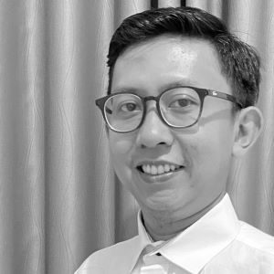

## About Me

Hi! My Name is **Ahmad Fikri Mudzaki** you can call me Eki, I am Full Stack QA Engineer

I have more than 10 years experiences. I really like to have challenges. Moreover, I could participate effectively in a team or work individually. I’m adaptable with any job environment and stack.  Also having many experience on testing field, it’s pleasure to learn and work with brand new technologies.

* Git: [GitHub](https://github.com/ekimudzaki)
* Email: [a.fikri.m@gmail.com](mailto:a.fikri.m@gmail.com)
* Phone: [+628569934348](tel:+628569934348)
* Address: Depok, Indonesia

## Experience
---

### Senior QA ENGINEER - WorlderGroup(03/2023 - Present)

* Responsible to evaluate SDLC in the company and standarized QA process in the team. 
* Improve the way the team testing and help developer and stackholder.
* Manage 2 teams to follow standarized process that company agreed to follow.
* Impement API testing using Postman newman and integrate it with Jenkins (CI/CD).

### LEAD QA ENGINEER - Gojek(02/2017 - 11/2022)

* Responsible to standardized QA process in MOKA Android by following company standard. Responsibe to maintain and optimize automated framework to cover 100% automatable cases using Java, RESTAssured for API automated test, Gitlab, BrowserStack as cloud testing, Spring, Appium. My team also improved our regression time from 19 hours to only 3 hours, 16 hours decrease of time.
* Leading 2 teams with two different product. Lead Merchant Platform, customize and improve automated framework, Enabling automated test on special device(POS EDC), create and maintain runner to be able to run it on EDC device and integrate it with CI/CD (Gitlab). Also improve our time in regeression test from 3 days to only 2 day.
* Responsible to do Full Test Cycle for Go-Send, maintain TestCases for Go-Send, Test API services using Postman. Sanity Check for old Android version, Sometimes become speaker for QA meetup. Manage to give an idea to create small web UI for 3rd party testing, and successfully decrease time to integrate with ecommerce from 3 days to only 1 day.

### Senior QA ENGINEER - Tokopedia(09/2016 – 01/2017)

* Tokopedia is a big ecommerce player in Indonesia, one of the unicorn startups. I worked as a Sr. Test Engineer that was responsible to maintain web, android & iOS automated tests. I was using a legacy framework from a previous engineer, it's a keyword driven framework based on selenium webdriver + Appium + Laravel (for frontend wise) + Jenkins as CI + Selenium grid to be able to run parallel. I only worked here for 5 months even if I passed the probation period because of personal reasons.

### FREELANCE QA - uTest,Inc (2011-2017)

* Responsible to run manual testing for many products like facebook mobile, autodesk 3D website, mobil123.com, HP Australia website, etc, also responsible to run test case and analyze the result. 

### Technical QA Engineer - HappyFresh (2015-2016)

* Responsible to test mobile,  website app. Also responsible for automation testing using Appium, Selenium webdriver with ruby API and cucumber (mobile & web app). And configure Jenkins for both automation test.

## Skills & Tools
---

 - OS (Mac, Windows, Linux)
 - Vitualization (docker)
 - CI/CD (gitlab, jenkins)
 - Language (Java, JavaScript, Ruby)
 - API testing (Postman, Newman, RestAssured, HttpToolkit, Charles Proxy, Flipper, Etc)
 - Functional Automated testing (Selenium, Appium, SeleniumGrid, Cucumber)
 - Manual testing (Web, Mobile)
 - Agile tools (JIRA, Trello)
 - Documentation (GDocs, Confluence)

## Projects
---

### Trainer - How to become QA engineer x Ministry of Manpower (Oct 2023)

* What is QA engineer?
* Career path of QA engineer
* How to become QA engineer
* Basic knowledge QA
* QA mindset
* Freelance as QA engineer

### Trainer -  Quality Engineering for Astra Honda Motor x Kodehive (Dec 2022)

* Basic knowledge QA
* Java for QA
* Create Framework using Spring, Selenium, SeleniumGrid, cucumber
* Parallel test using SeleniumGrid docker
* Integration with Jenkins

<!-- ### Trainer - Sharing session about QA x University of Indonesia (2021)

* Introduction to QA
* Daily task as QA Engineer
* How to start become QA Engineer
* Freelancing as QA Engineer  -->

<!-- ### Speaker - Sharing session about QA x ISQA (2018)

* What we do in Gojek
* Share about Appium Ruby Console [arc GitHub](https://github.com/appium/ruby_console) -->

## Certification
---

1. iSQI GmbH, License 15-CMAPFL-TE-80220-31

## Education
 ---

> (2013 – 2016)
> BACHELOR DEGREE IN IT ENGINEERING
> UNIVERSITAS MERCUBUANA

> (2009-2012)
> ASSOCIATE DEGREE IN INFORMATICS
> IT TELKOM, BANDUNG
