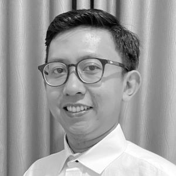

## About Me

Hi! My Name is **Ahmad Fikri Mudzaki** you can call me Eki, I am Full Stack QA Engineer

I'm passionate with QA field with more than 10 years experiences. I really like to have challenges. Moreover, I could participate effectively in a team or work individually. I’m very adaptable with any job environment and also having many experience on testing field, it’s pleasure to learn and work with brand new technologies.

You can find My [GitHub](https://github.com/ekimudzaki)

## Experiences
---

### LEAD QA ENGINEER - Gojek(Feb 2017 - Nov 2022)

* Responsible to standardized QA process in MOKA Android by following company standard. Responsibe to maintain and optimize automated framework to cover 100% automatable cases using JAVA, RESTAssured for API automated test, Gitlab, BrowserStack as cloud testing, Spring, Appium
* Leading 2 teams with two different product. Lead Merchant Platform, customize and improve automated framework, Enabling automated test on special device(POS EDC), create and maintain runner to be able to run it on EDC device and integrate it with CI/CD (Gitlab).
* Responsible to do Full Test Cycle for Go-Send, maintain TestCases for Go-Send, Test API services using Postman. Sanity Check for old Android version, Sometimes become speaker for QA meetup.

### Senior QA ENGINEER - Tokopedia(Sep 2016 – Jan 2017)

* Responsible to maintain automation TestCases for mobile app, fixing and adding feature on automation framework (using java and php).

### FREELANCE QA - uTest, Inc(May 2011 – Jan 2017)

* Responsible to run manual testing for many products like facebook mobile, autodesk 3D website, mobil123.com, HP Australia website, etc, also responsible to run test case and analyze the result. 
 
### TECHNICAL QA ENGINEER - HappyFresh(Nov 2015 – Sep 2016)

* Responsible to test mobile,  website app. Also responsible for automation testing using Appium, Selenium webdriver with ruby API and cucumber (mobile & web app). And configure Jenkins for both automation test.  

### TECHNICAL QA ENGINEER - 2359 MEDIA, PTE, LTD(Nov 2014 – Nov  2015)
                       
* Responsible to test various mobile,  website apps  such as NewsLoop, Tripple, Condo apps, MediaCorp, DBS HomeConnect. Also responsible for automation testing using calabash, appium with ruby API. Creating UAT document, also test planning document.  

### TECHNICAL QA ENGINEER - KANA SOFTWARE, INC(March 2013 – Oct  2014)

* Responsible to run manual testing for KANA ENTRERPRISE, also responsible to run performance testing and analyze the result. Also become setupper test server in Jakarta Office to configure Mail Server ( postfix + squirrelmail ), AppServ Conf ( JBoss ), Database Server ( DB2, Sql Server, Oracle Enterprise ). 

## Skills & Tools
---

 - OS (Mac, Windows, Linux)
 - Vitualization (docker)
 - CI/CD (gitlab, jenkins)
 - Language (Java, JavaScript, Ruby)
 - API testing (Postman, Newman, RestAssured, HttpToolkit, Charles Proxy, Flipper, Etc)
 - Functional Automated testing (Selenium, Appium, SeleniumGrid, Cucumber)
 - Manual testing (Web, Mobile)
 - Agile tools (JIRA, Trello)
 - Documentation (GDocs, Confuence)

## Projects
---

### Quality Engineering for Astra Honda Motor x Kodehive (Dec 2022)

* Basic knowledge QA
* Java for QA
* Create Framework using Spring, Selenium, SeleniumGrid, cucumber
* Parallel test using SeleniumGrid docker
* Integration with Jenkins

### Sharing session about QA x University of Indonesia (2021)

* Introduction to QA
* Daily task as QA Engineer
* How to start become QA Engineer
* Freelancing as QA Engineer 

### Sharing session about QA x ISQA (2018)

* What we do in Gojek
* Share about Appium Ruby Console [arc GitHub](https://github.com/appium/ruby_console)

## Certification
---

1. iSQI GmbH, Lisensi 15-CMAPFL-TE-80220-31

## Education
 ---

> (2013 – 2016)
> BACHELOR DEGREE IN IT ENGINEERING
> UNIVERSITAS MERCUBUANA

> (2009-2012)
> ASSOCIATE DEGREE IN INFORMATICS
> IT TELKOM, BANDUNG
